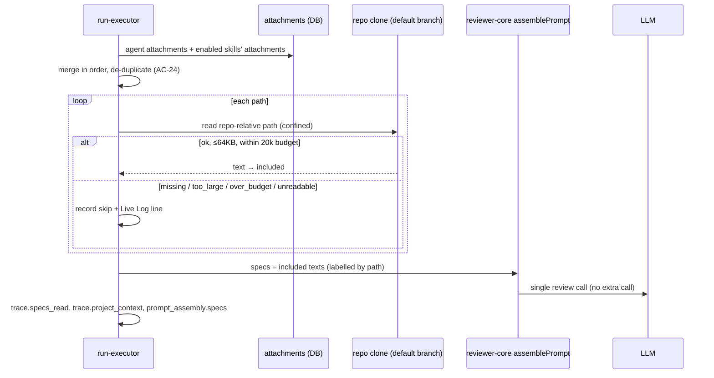

# Spec: Project Context   |   Spec ID: SPEC-01   |   Status: approved
Modules: server (new `project-context` module, `agents`, `skills`, `reviews` run-executor, `@devdigest/shared` contracts), reviewer-core (prompt assembly — `## Project context` section), client (Project Context page, Agent editor → Context tab, Skill detail → Context tab, Run trace drawer)
Supersedes: —

## Problem and why

Reviewer agents judge a diff without knowing the project's own requirements.
Requirements already live in the repo as Markdown (`specs/`, `docs/`,
`insights/` — PRDs, security baselines, incident write-ups), but there is no
way to put them in front of the model. As a result, an agent cannot flag
"public endpoint without rate limiting" against a PRD that requires it.

The plumbing is half there: reviewer-core already renders a `## Project
context` section from `specs` as untrusted, delimiter-wrapped data. The run
trace already has `prompt_assembly.specs` and `specs_read` slots, and the
client trace drawer already renders them. But the run-executor always passes
nothing (`specs_read: []`), and nothing in the product lets anyone choose
documents.

This feature lets a user **browse** the project's Markdown documents, **attach**
them by hand to agents and skills, **see the token cost** of the attached
documents up front, and **audit** the injected text in the run trace afterwards.

## Goals / Non-goals

**Goals**

- G1. Server discovers `.md` documents in a repo's local clone under
  configurable roots (default glob `**/{specs,docs,insights}/**/*.md`).
- G2. A repo-scoped **Project Context** page lists those documents and shows a
  read-only rendered preview, size in tokens and "Used by N agents".
- G3. Users attach documents by hand to an **agent** (Agent editor → Context
  tab) and to a **skill** (Skill detail → Context tab, "Project context to
  use"). Both tabs have a checkbox, path, type badge, filter, preview, ordering
  and a live token total.
- G4. Attachments are stored as **repo-relative paths, never text**.
- G5. At run start, the run-executor reads the attached files from the clone and
  injects them into `## Project context` as untrusted data, with delimiters
  and the injection guard. This adds no extra LLM call.
- G6. The run trace shows `specs_read`, every document considered with its
  token size and outcome (included / skipped + reason), and the full injected
  text under **"Project context — attached specs (untrusted)"**.

**Non-goals** (explicitly out of scope for this spec)

- NG1. **Editing documents** in the UI. The clone is a read-only mirror, and
  every sync runs `reset --hard`, so local edits would be silently lost.
  Writing back needs commit/push/PR to GitHub and write access. The design's
  `Edit` toggle and the create / new-folder / upload toolbar buttons are **not**
  built (user decision). Editing may come later as a separate feature.
- NG2. **Automatic selection** of relevant documents from PR content (content
  selector / RAG). This is a separate future feature, and selection here is
  manual only.
- NG3. **Versioning** of context attachments. Attaching or detaching documents
  does not bump `agents.version` / `skills.version` and creates no
  `agent_versions` / `skill_versions` row (user decision: simplest
  implementation).
- NG4. The **Coverage** ring (`78 COVERAGE`) from the design. Only the usage
  count ("Used by N agents") is shown.
- NG5. Reading documents from the **PR head**. Content always comes from the
  clone's current default-branch working tree (user decision). If a PR edits
  an attached spec, the review sees the pre-PR version.
- NG6. Embedding / chunking documents. In the design's footer copy
  "Indexed: … chunks", "chunks" is replaced by "tokens total" (AC-11).
- NG12. An "Inherited by N agents" counter on the Skill Context tab (user
  decision: not now).
- NG7. Per-repo configuration UI for search roots. Roots are server
  configuration only.
- NG8. Tracking renames. A renamed or moved file shows up as a *missing*
  attachment plus a new unattached document.
- NG9. Non-Markdown files (`.mdx`, `.txt`, `.rst`, images, PDFs).
- NG10. **CI-runner runs** (`source: 'ci'`). Their prompt is unchanged in v1,
  and project context is injected only into server-side (local) runs (user
  decision).
- NG11. A **keyboard alternative** to drag-and-drop reordering. v1 is
  drag-only (user decision), and the gap is tracked for a follow-up.

## User stories

- US-1. As a team lead, I want to browse all specs/docs/insights of a repo and
  read them in the app, so I know what context is available.
- US-2. As an agent author, I want to attach specific documents to an agent and
  order them, so that agent always reviews against those requirements.
- US-3. As a skill author, I want to attach documents to a skill, so every agent
  that uses the skill inherits them.
- US-4. As an agent/skill author, I want to see how many tokens the attached
  documents add to each prompt before I run anything, so I can control cost.
- US-5. As a reviewer of a run, I want the trace to show which documents were
  read, their token size, which were skipped and why, and the full injected
  text, so I can audit what the model saw.
- US-6. As an operator, I want a missing, oversized or unreadable document to
  never break a review run. It should be skipped and recorded instead.

## Acceptance criteria (EARS)

### Discovery (server)

- **AC-1.** WHEN the documents of a repo are requested, the server shall return
  every regular file in the repo's clone working tree that ends in `.md` and
  matches at least one configured search glob. The default glob is
  `**/{specs,docs,insights}/**/*.md`.
  Verify: integration — seed a clone containing `specs/a.md`,
  `docs/x/b.md`, `insights/c.md`, `src/readme.md`, `specs/d.txt`. The list
  contains exactly the first three.
- **AC-2.** The server shall exclude anything under `.git/` and `node_modules/`
  from discovery, and shall not follow symbolic links.
  Verify: integration — a symlink `specs/link.md → /etc/hosts` and
  `node_modules/x/specs/y.md` are absent from the list.
- **AC-3.** The server shall return each document with: `path` (repo-relative,
  forward slashes), `type` ∈ {`specs`, `docs`, `insights`} (from the first path
  segment named `specs`, `docs` or `insights`; `docs` when no segment
  matches, e.g. under a custom glob), `size` in bytes, `est_tokens` =
  ⌈characters / 4⌉ (the heuristic already used by the prompt composition
  stats), and `updated_at`.
  Verify: unit — a 1,000-character file yields `est_tokens: 250`; the
  `docs/specs/x.md` type is `docs`; `adr/a.md` (custom glob) type is `docs`.
- **AC-4.** The server shall read the search globs from server configuration. If
  no globs are configured, it shall use the default glob from AC-1.
  Verify: integration — set the config to `**/adr/**/*.md` and only ADR files
  are listed.
- **AC-5.** IF the repo has no local clone (`clone_path` is null or the
  directory is absent), THEN the server shall respond with a typed error
  `context_unavailable`, and the client shall show a "Repository not cloned yet"
  state with a sync action instead of an empty list.
  Verify: integration — repo with null `clone_path` → 4xx with code
  `context_unavailable`; UI shows the not-cloned state.
- **AC-6.** WHEN a single document is requested by path, the server shall
  return its full text only if the path is repo-relative, resolves inside the
  clone after normalisation, ends in `.md` and matches a configured glob.
  Otherwise it shall reject the request with `400 invalid_path`.
  Verify: integration — `../../etc/passwd`, `/etc/passwd`, `src/a.ts`,
  `specs/../src/a.md` → 400; `specs/a.md` → 200 with content.

### Project Context page (client)

- **AC-7.** The Project Context page (`Project Context` in the sidebar, scoped
  to the active repo) shall list the discovered documents as a tree grouped
  by folder, showing the search root(s) as a subtitle.
  Verify: e2e — open the page for a seeded repo; all seeded files are visible
  under their folders.
- **AC-8.** WHEN the user selects a document, the page shall show its file name
  and a **read-only** rendered Markdown preview. There shall be no `Edit` toggle,
  no create, no new-folder and no upload control.
  Verify: e2e — click a file and the preview renders headings/lists/code. No
  editable control is present.
- **AC-9.** The preview header shall show "Used by N agents". N is the number
  of distinct agents in the workspace that either attach the document
  directly or link an enabled skill that attaches it. Hovering or clicking the
  count lists those agents.
  Verify: integration + e2e — agent A attaches the document directly and agent
  B links a skill that attaches it → "Used by 2 agents".
- **AC-10.** WHEN the user clicks the refresh control, the client shall
  re-request the document list from the server, which rescans the clone, and
  update the list without a full page reload.
  Verify: e2e — add a file to the clone, click refresh, and the file appears.
- **AC-11.** The page footer shall show "Indexed: `<N>` files · `<T>` tokens
  total" and, on the next line, "last `<relative time>` ago". T is the sum of
  `est_tokens` across all listed documents. This replaces the design's
  "`<N>` chunks" copy.
  Verify: e2e — footer reads e.g. "Indexed: 12 files · 1,240 tokens total",
  and the numbers match the seeded files.
- **AC-12.** WHILE the list is loading, the page shall show a loading skeleton.
  IF the repo has zero matching documents, THEN the page shall show an empty
  state that names the configured globs.
  Verify: unit (RTL) — loading and empty states render the expected copy.

### Attaching documents — Agent editor Context tab

- **AC-13.** The Agent editor shall have a **Context** tab between `Skills` and
  any later tabs. It shall list the active repo's documents, each row with a
  checkbox, path, folder, type badge (`specs` / `docs` / `insights`, with
  distinct colours) and a Preview action.
  Verify: e2e — open an agent → Context; rows match the repo's documents.
- **AC-14.** WHEN the user checks or unchecks a row, the system shall persist
  the attachment as the document's repo-relative path. It shall not store the
  document text, and it shall not bump the agent's version (NG3).
  Verify: integration — after attaching, the DB holds the path string only;
  `agents.version` is unchanged.
- **AC-15.** The Context tab shall show an "`<k>` of `<n>` attached" badge and
  a filter input that narrows rows by case-insensitive path substring.
  Verify: unit (RTL) — typing `rate` leaves only `rate-limiting.md`; the badge
  counts attached rows, not visible rows.
- **AC-16.** Attached documents shall be shown first, in their persisted
  order. The user shall be able to reorder attached rows by drag-and-drop, and
  the new order shall be persisted. Unattached rows follow in alphabetical path
  order and are not draggable.
  Verify: e2e — drag `public-api.md` above `security-baseline.md`, reload, and
  the order holds.
- **AC-17.** The Context tab shall show "≈ `<T>` tokens" for the agent's
  **effective** document set, defined in AC-24 (own attachments plus documents
  inherited from its enabled skills, de-duplicated). T is the sum of their
  `est_tokens`. T shall update immediately when a checkbox changes.
  Verify: unit — toggling a 1,000-char document changes the total by 250.
- **AC-18.** The Context tab shall show documents inherited from the agent's
  enabled linked skills as read-only rows labelled "via `<skill name>`". Those
  rows count toward the token total (AC-17) and cannot be unchecked from the
  agent.
  Verify: e2e — skill S attaches `public-api.md` and agent links S. The agent's
  Context tab shows the row as "via S", disabled.
- **AC-19.** The Context tab shall state that the documents are "Injected as an
  untrusted block (`## Project context`) into every run" and that "Order
  matters — earlier docs appear earlier".
  Verify: visual / RTL text assertion.
- **AC-20.** WHEN the user clicks Preview on a row, the system shall open the
  document's rendered read-only text in a modal or drawer without leaving the
  tab. Esc shall close it and return focus to the Preview button.
  Verify: e2e + a11y check.

### Attaching documents — Skill detail Context tab

- **AC-21.** The Skill detail view shall have a **Context** tab titled "Project
  context to use", with the same row anatomy, filter, "`<k>` attached" badge,
  preview and ordering as AC-13…AC-16. Its subtitle shall read "Any agent using
  this skill inherits these documents."
  Verify: e2e — open a skill → Context; attach a document; the badge reads "1
  attached".
- **AC-22.** The Skill Context tab shall show a **"Serializes as"** block that
  lists the attached paths in order, under the heading the prompt will use.
  Verify: unit — attaching `specs/public-api.md` renders
  `## Project context` + `- specs/public-api.md`.
- **AC-22a.** The Skill Context tab shall show "≈ `<T>` tokens". T is the sum
  of `est_tokens` of the skill's attached documents, and it updates
  immediately when a checkbox changes. This is the amount the skill adds to
  every review prompt of an agent that uses it, before de-duplication.
  Verify: unit (RTL) — attaching a 1,000-char document raises the total by 250.
- **AC-23.** WHEN a skill's attachments change, the system shall not bump the
  skill's version or create a `skill_versions` row (NG3).
  Verify: integration — `skills.version` is unchanged after attach.

### Run-time injection (run-executor + reviewer-core)

- **AC-24.** WHEN a review run starts for an agent on a PR, the run-executor
  shall compute the agent's effective document list in this order:
  (1) the agent's own attachments in persisted order, then (2) for each linked
  skill that reaches the prompt (agent link enabled AND skill enabled), in the
  agent's skill order, that skill's attachments in their order. Duplicates
  shall be removed, keeping the first occurrence.
  Verify: unit — agent `[a, b]`, skill1 `[b, c]`, skill2 `[a, d]` →
  `[a, b, c, d]`.
- **AC-25.** For each document in the effective list, the run-executor shall
  read the file from the clone working tree of the **PR's repo** (default
  branch, NG5), resolving the stored repo-relative path.
  Verify: integration — an agent attaches `specs/x.md`; a run on a PR of repo R
  injects R's `specs/x.md` content.
- **AC-26.** The system shall inject each included document into the
  `## Project context` section as a separate `<untrusted source="…">` block
  whose source label is the document's repo-relative path. The existing
  closing-tag escaping and the SECURITY injection guard shall apply.
  Verify: unit (reviewer-core) — a document containing `</untrusted>` and
  "ignore previous instructions" is wrapped, the tag escaped, and the guard
  present in the system prompt.
- **AC-27.** IF an attached path does not exist in the PR's repo clone (or the
  repo has no clone), THEN the run-executor shall skip that document, record
  it with status `missing`, write one Live Log line, and continue the run.
  Verify: integration — attach `specs/gone.md`, delete it from the clone, and
  run: the run completes `done` and the trace lists `specs/gone.md` as
  `missing`.
- **AC-28.** IF an attached document is larger than 64 KB (65,536 bytes), THEN
  the run-executor shall skip it whole (no truncation) and record it with
  status `too_large`.
  Verify: integration — a 70 KB document → status `too_large`, not in the
  prompt.
- **AC-29.** WHILE adding the next document would push the running total of
  included documents over 20,000 estimated tokens, the run-executor shall skip
  that document, record it with status `over_budget`, and continue evaluating
  later documents in order.
  Verify: unit — documents of 15k, 8k, 3k tokens → included 15k and 3k;
  8k is `over_budget`.
- **AC-30.** IF reading a document fails for any other reason (permission,
  encoding, path rejected by the AC-6 rules), THEN the run-executor shall skip
  it with status `unreadable` and continue. A project-context failure shall
  never change a run's final status.
  Verify: integration — a document with no read permission → run `done`,
  status `unreadable`.
- **AC-31.** WHERE the agent's effective document list is empty, the system
  shall omit the `## Project context` section entirely, so the prompt is
  byte-identical to today's prompt.
  Verify: unit — the assembled prompt for an agent with no attachments equals
  the pre-feature snapshot.
- **AC-32.** The system shall add project context without any extra LLM call.
  Verify: integration — mock LLM call count for a run with 3 attached documents
  equals the count without them.

### Run transparency (trace)

- **AC-33.** WHEN a run completes or fails after context resolution, the trace
  shall contain `specs_read` = the ordered list of repo-relative paths that
  were actually injected.
  Verify: integration — the trace JSON `specs_read` equals the included paths.
- **AC-34.** The trace shall contain `project_context`, one entry per document
  in the effective list: `{ path, origin: "agent" | "skill", skill_name?,
  est_tokens, status: "included" | "missing" | "too_large" | "over_budget" |
  "unreadable" }`.
  Verify: integration — the AC-27/28/29 scenarios produce the matching entries.
- **AC-35.** The trace drawer's **Configuration** section shall show "Specs
  read" with each included path and its token size. Skipped documents shall be
  shown with their status reason.
  Verify: e2e — the drawer shows `specs/public-api.md · 412 tok` and
  `specs/gone.md — missing`.
- **AC-36.** The trace drawer's **Prompt assembly** section shall show a block
  labelled **"Project context — attached specs (untrusted)"** whenever
  `prompt_assembly.specs` is non-null. Expanding it shall show the full injected
  text exactly as sent, and copy shall copy that text.
  Verify: e2e — expand the block; the text contains each document's full
  content inside its `<untrusted source="…">` wrapper.
- **AC-37.** The run's Live Log shall contain one summary line for project
  context: "project context: `<i>` of `<n>` document(s) attached, ≈`<T>`
  tokens", followed by one line per skipped document with its reason.
  Verify: integration — log lines are present in the persisted trace `log`.
- **AC-38.** Traces persisted before this feature (without `project_context`)
  shall still parse and render. The missing field is treated as an empty list.
  Verify: unit — parsing a legacy trace fixture succeeds.

### Lifecycle

- **AC-39.** WHEN an agent or skill is deleted, the system shall delete its
  context attachments.
  Verify: integration — delete an agent; no attachment rows remain for it.
- **AC-40.** IF an attached path is not present in the active repo's document
  list, THEN the Agent/Skill Context tab shall still show it as a row marked
  "missing in `<repo>`". The row can still be detached and contributes 0
  tokens.
  Verify: e2e — attach a document, remove it from the clone, refresh; the row
  shows "missing" and can be detached.

### Pre-run warnings

- **AC-41.** IF a document is larger than 64 KB, THEN its row in the Agent and
  Skill Context tabs shall show a "Too large — will be skipped" warning badge.
  Attaching it shall still be allowed.
  Verify: unit (RTL) — a 70 KB fixture row renders the badge, and its checkbox
  stays enabled.
- **AC-42.** WHILE the effective token total (AC-17) exceeds 20,000, the Agent
  Context tab shall show the total in the warning colour with the text "over
  the 20k budget — later documents will be skipped".
  Verify: unit (RTL) — a 21k total renders the warning text.

## Edge cases

| # | Case | Expected behaviour |
|---|---|---|
| E1 | Attached file deleted/renamed in repo | Run: skip + record `missing` (AC-27). UI: "missing" row (AC-40). |
| E2 | Agent used on several repos; doc exists in only one | Per-run resolution against the PR's repo (AC-25); `missing` elsewhere (AC-27). |
| E3 | Same doc attached directly and via a skill | Included once, first occurrence wins (AC-24). The UI shows the direct row as checked and the inherited one as "via …". |
| E4 | Document > 64 KB | Skipped whole, `too_large` (AC-28). The UI row shows a warning badge (AC-41). |
| E5 | Attached set > 20k tokens | Later documents skipped `over_budget` (AC-29). The tab total shows a warning (AC-42). |
| E6 | Doc contains prompt-injection text / `</untrusted>` | Wrapped, tag escaped, guard applies (AC-26). |
| E7 | Path traversal / absolute path / symlink | Rejected (AC-2, AC-6, AC-30). |
| E8 | Repo not cloned yet / clone mid-sync | Page: `context_unavailable` state (AC-5). Run: all docs `missing`, run continues (AC-27). |
| E9 | Non-UTF-8 or binary content with `.md` extension | `unreadable` at run time (AC-30). Preview shows an error state. |
| E10 | Empty `.md` file | Listed with 0 tokens. At run time it is included as an empty block. |
| E11 | Very long paths / unicode file names | Rendered truncated with a full-path tooltip; stored verbatim. |
| E12 | Concurrent edits of the same agent's attachments in two tabs | Last write wins; on refetch, both tabs converge. |
| E13 | Repo with thousands of Markdown files | Discovery bounded by the NFR-P1 budget; the filter works client-side. |
| E14 | Skill disabled globally or unlinked for the agent | Its documents are not inherited (AC-24) and not shown "via" (AC-18). |
| E15 | Active repo switched while on an agent's Context tab | The list reloads for the new repo. Attachments not present there show as "missing" (AC-40). |
| E16 | Run cancelled during context resolution | Existing cancel semantics apply. The trace records whatever was resolved. |

## Non-functional

- **Performance**
  - NFR-P1. The document-list endpoint shall respond in ≤ 1 s p95 for a clone
    with ≤ 50,000 files of which ≤ 2,000 match the globs.
  - NFR-P2. Context resolution shall add ≤ 300 ms to a run with ≤ 20 attached
    documents.
- **Security**
  - NFR-S1. Every document is untrusted data: delimiter-wrapped with the
    escaped closing tag, under the existing injection guard (AC-26).
  - NFR-S2. File access is confined to the clone. Traversal, absolute paths
    and symlinks are rejected (AC-2, AC-6).
  - NFR-S3. The Markdown preview must not execute repo-supplied HTML/JS. Raw
    HTML is sanitised or not rendered, and links open with
    `rel="noopener noreferrer"`.
  - NFR-S4. Only workspace members can list, read or attach documents of the
    workspace's repos (same authorisation as the existing repo routes).
- **Accessibility**
  - NFR-A1. Checkboxes, Preview and filter are keyboard-operable with visible
    focus. The preview modal traps focus and closes on Esc (AC-20).
  - NFR-A2. Reordering is drag-only in v1 (NG11). It is a known accessibility
    gap, but attach/detach stays fully keyboard-operable.
  - NFR-A3. Type badges are not distinguished by colour alone, because the
    text label is always present.
- **Reliability / observability**
  - NFR-R1. Context failures never fail a run (AC-27…AC-30). Every skip is
    visible in the trace (AC-34) and Live Log (AC-37).
- **Privacy**: N/A — documents come from the user's own repo and stay within
  the existing LLM data flow; no new third party is introduced.
- **i18n**: all new UI copy goes through `next-intl` message files.

## Inputs (provenance)

| Input | Provenance |
|---|---|
| Document list & content | [deterministic: filesystem scan of `repos.clone_path` working tree, default branch, after the existing sync] |
| Search globs | [config: server configuration, default `**/{specs,docs,insights}/**/*.md`] |
| Attachments (agent → paths, skill → paths, order) | [persisted: new attachment data owned by the server, paths only] |
| Agent ↔ skill links & enabled flags | [reused: `agent_skills`, `skills.enabled`] |
| Token estimate | [deterministic: ⌈chars/4⌉, reused from reviewer-core composition stats] |
| Prompt section & wrapping | [reused: reviewer-core `assemblePrompt` `specs` part, `wrapUntrusted`, injection guard] |
| Trace slots | [reused: `RunTrace.specs_read`, `PromptAssembly.specs`; extended with `project_context` (AC-34)] |
| Existing client contracts | [reused: `SpecFile`, `useContextFiles` (`GET /repos/:repoId/context`) in `@devdigest/shared` platform contracts — to be extended with `type`, `est_tokens`] |
| Active repo on workspace-level pages | [reused: client `useActiveRepo`] |

### Contracts (behaviour-defining shapes)

- `GET /repos/:repoId/context` → `ContextDoc[]` where `ContextDoc = { path,
  type: 'specs'|'docs'|'insights', size, est_tokens, updated_at,
  used_by_agents: number }` (extends existing `SpecFile`).
- `GET /repos/:repoId/context/file?path=<repo-relative>` → `{ path, content,
  size, est_tokens }` | `400 invalid_path` | `404 not_found` |
  `409 context_unavailable`.
- Agent and skill attachments: read and replace the ordered path list, for
  example `GET|PUT /agents/:id/context` and `GET|PUT /skills/:id/context` with
  body `{ paths: string[] }` (ordered). The planner may choose another shape if
  it stays paths-only.
- `RunTrace.project_context?: Array<{ path; origin: 'agent'|'skill';
  skill_name?: string; est_tokens: number; status: 'included'|'missing'|
  'too_large'|'over_budget'|'unreadable' }>`. This field is optional for
  backward compatibility (AC-38).

### Run flow

## Untrusted inputs

- **Document text** is repo content that any contributor can author, so it is
  a prompt-injection vector. It is always data, never instructions: each
  document is wrapped in its own `<untrusted source="<path>">` block, with
  closing tags escaped and the SECURITY guard in the system prompt (AC-26).
  It is placed under `## Project context`, never in the system prompt.
- **Document text in the UI preview** is untrusted HTML/Markdown and is
  sanitised (NFR-S3).
- **File paths** from the client are untrusted, so they are validated and
  confined (AC-6).

## Traceability

| Story | ACs | Edge cases / NFRs | Source |
|---|---|---|---|
| US-1 browse | AC-1–AC-12 | E8, E9, E10, E11, E13, NFR-P1, NFR-S2, NFR-S3 | user text (Reader); design "Project Context (N6)" |
| US-2 agent attach | AC-13–AC-20, AC-39, AC-40 | E1, E3, E12, E15, NFR-A1–A3 | user text (Manual attach); design "Agents → Context" |
| US-3 skill attach | AC-21–AC-23, AC-18, AC-24, AC-39 | E3, E14 | user text; design "Skill Editor · Context" |
| US-4 token cost | AC-3, AC-11, AC-17, AC-18, AC-22a, AC-41, AC-42 | E4, E5 | user text ("count tokens"); design "≈ 317 tokens" |
| US-5 audit | AC-33–AC-38, AC-32 | E16, NFR-R1 | user text (Run transparency); design "Agent run trace" |
| US-6 resilience | AC-25–AC-31 | E1, E2, E4–E9, NFR-S1, NFR-R1 | user text ("skip and record") |

## [NEEDS CLARIFICATION]

None open. Resolved with the user on 2026-10-10:

- Q1 CI runs: out of scope, recorded as NG10.
- Q2 keyboard reordering: drag-only in v1, recorded as NG11 / NFR-A2.
- Q3 pre-run size warnings: accepted, recorded as AC-41 and AC-42.
- Q4 usage count: counts direct and skill-inherited agents (AC-9).
